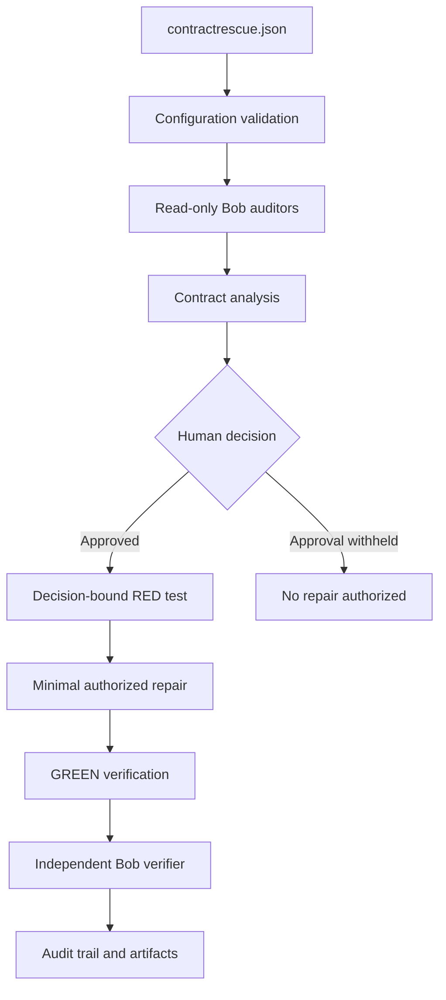

# ContractRescue — Make every layer agree.

ContractRescue is a configurable IBM Bob-powered workflow for governed API contract reconciliation. It detects cross-layer mismatches across documentation, frontend consumer code, backend provider code, and tests; presents the evidence for a human decision; generates a decision-bound failing test; applies a minimal authorized repair; and independently verifies the result — with a complete audit trail.

> **Current state:** IBM Bob-native, repository-based prototype. Users configure and run the workflow inside an IBM Bob workspace. This is not a browser extension, deployed SaaS product, or fully automated production platform.

---

## The problem

API layers can each appear internally correct while disagreeing with each other. Layer-specific unit tests pass because they only validate local assumptions. The cross-layer mismatch stays invisible until something checks all layers simultaneously.

**CR-001 — reservation API duplicate-status mismatch (historical, now repaired):**

| Layer | Expected status for duplicate reservation |
|---|---|
| `docs/api-contract.md` | 409 |
| Frontend `DUPLICATE_RESERVATION_STATUS` | 409 |
| Backend `createReservation` — **pre-repair** | **400** |
| Backend unit test — **pre-repair** | **400** |

Because the frontend routes only HTTP 409 to its `"conflict"` outcome branch, the backend's 400 response would have caused any duplicate reservation to produce `"unexpected_error"` at the consumer — a silent behavioral contract break. Both the backend and its unit test passed independently. The mismatch was undetectable without cross-layer investigation.

**Current state (post-repair):** the backend returns HTTP 409 and all layers agree.

---

## The solution

ContractRescue works through seven governed phases:

1. **Validate** — `contractrescue.json` is checked before anything runs; invalid configuration is reported immediately and nothing proceeds.
2. **Investigate** — Three read-only Bob auditors inspect the provider, consumer, and documentation/test evidence layers in parallel. No source file is touched.
3. **Consolidate** — Bob merges findings into `artifacts/contract-analysis.json` and surfaces the blocking contradiction with a recommendation.
4. **Human decision** — A developer reviews the evidence in the dashboard and may explicitly record an approval in `artifacts/approved-decision.json`. If the developer does not approve, no implementation authorization is created and the workflow stops without repair.
5. **Decision-bound RED test** — Bob generates a contract test that reads the authorized status at runtime from the decision artifact. The test is executed before repair and must fail.
6. **Minimal authorized repair** — Bob modifies only the files permitted by the approved decision. No unrelated code, tests, or configuration is changed.
7. **GREEN verification + independent verifier** — All three required test commands pass. The `contract-verifier` runs in a separate IBM Bob task after implementation. It independently rereads the approved evidence, executes fresh verification commands, and does not rely on the repair task's conclusions as proof.

The **dashboard** is the human decision and traceability interface. It presents the investigation findings and records the approval. It is one component of the workflow, not the product itself.

---

## How it works



The provider, consumer, and contract-evidence auditors are read-only investigation personas active during phases 2–3. The contract verifier is a separate persona that operates only after repair in phase 7.

---

## Why unit tests alone are insufficient

| Unit tests | ContractRescue |
|---|---|
| Validate local assumptions within one layer | Checks cross-layer agreement across all sources simultaneously |
| Do not choose which layer is authoritative | Records a human decision as the authoritative source of truth |
| May all pass while integration behavior is wrong | Requires a RED failure before any repair is authorized |
| Produce no pre/post repair contract evidence | Produces decision-bound RED and GREEN contract test evidence |
| No audit trail of the resolution process | Complete chain: analysis → decision → test → repair → verification |

---

## IBM Bob's role

Bob is both the build platform and the execution layer for the ContractRescue workflow.

- **Three read-only auditor subagents** — `contract-evidence-auditor`, `consumer-auditor`, and `provider-auditor` run in parallel during investigation. They read source files and produce structured findings; they do not write or modify any file.
- **Separate contract verifier** — The `contract-verifier` runs in a separate IBM Bob task after implementation. It independently rereads the approved evidence, executes fresh verification commands, and does not rely on the repair task's conclusions as proof.
- **Governed repair** — Bob applies the minimal authorized repair only after a human has approved the decision and the decision-bound RED test has been executed and has failed.
- **Human approvals** — Every decision, every authorized file change, and every configured command requires explicit human approval. Bob does not auto-approve anything.
- **Bob task-session evidence** — `bob_sessions/` contains exported screenshots from relevant IBM Bob task-session summaries across investigation, repair, verification, capability testing, and documentation work.

IBM Bob is required to execute the auditor, governed repair, and independent-verifier workflow. The `npm` commands in this repository validate configuration, run tests, and start the dashboard — they do not invoke IBM Bob.

---

## Configuration and portability

[`contractrescue.json`](contractrescue.json) is the single configuration file that describes what to investigate. The validated schema uses these top-level keys: `schemaVersion`, `project`, `sources`, `commands`, and `artifacts`.

```jsonc
{
  "schemaVersion": "1.0",
  "project": {
    "name": "ContractRescue Demo",
    "description": "Reservation API contract mismatch demonstration"
  },
  "sources": {
    "provider":      { "required": true,  "paths": ["backend/reservation-service.js", "backend/server.js"] },
    "consumer":      { "required": false, "paths": ["frontend/src/api/reservations.js"] },
    "documentation": { "required": false, "paths": ["docs/api-contract.md"] },
    "tests":         { "required": false, "paths": [
                         "tests/unit/reservation-service.test.js",
                         "tests/unit/frontend-reservation.test.js",
                         "tests/contract/reservation-contract.test.js"
                       ] }
  },
  "commands": {
    "unitTests":     { "program": "npm", "args": ["run", "test:unit"] },
    "contractTests": { "program": "npm", "args": ["run", "test:contract"] },
    "allTests":      { "program": "npm", "args": ["test"] }
  },
  "artifacts": { "directory": "artifacts" }
}
```

- **Provider evidence is required.** The auditor cannot proceed without a backend source.
- **Consumer, documentation, and test sources are optional.** When an optional category contains valid configured paths, it is enabled and its applicable auditor participates. When it is absent, empty, unsafe, or unavailable, ContractRescue skips or reports that evidence according to validator rules without inventing replacement paths.
- **Provider-only config** is a supported capability: a config with only the provider source enabled passes validation and activates exactly one auditor persona.
- **Adapting to another repository** means updating the `project`, `sources`, `commands`, and `artifacts` fields. See [`QUICKSTART.md`](QUICKSTART.md) for a step-by-step starting point.

ContractRescue is currently a repository-based prototype. It does not install globally or connect to external services.

---

## Quickstart

See **[QUICKSTART.md](QUICKSTART.md)** for the full step-by-step guide.

Requires **Node.js 20 or later**. No `npm install` needed — the project has zero external dependencies.

```bash
# 1. Validate configuration
npm run contractrescue:validate

# 2. Run the complete test suite
npm test

# 3. Start the completed decision dashboard
npm run dashboard
```

---

## Verified CR-001 result

### Pre-repair RED (historical)

The decision-bound contract test was executed before repair against the unmodified backend:

```
node --test tests/contract/generated/duplicate-reservation-approved.test.js
→ pass 0, fail 1
AssertionError: Expected provider to return HTTP 409 … but received 400
```

Recorded in [`artifacts/test-results.pre-repair.json`](artifacts/test-results.pre-repair.json) (run ID: CR-001-RED-001).

### Post-repair GREEN (historical)

After the minimal authorized repair, all three required commands were executed:

| Command | pass | fail |
|---|---|---|
| `node --test tests/contract/generated/duplicate-reservation-approved.test.js` | 1 | 0 |
| `npm run test:contract` | 1 | 0 |
| `npm run test:unit` | 4 | 0 |

Recorded in [`artifacts/test-results.post-repair.json`](artifacts/test-results.post-repair.json) (run ID: CR-001-GREEN-001). The generated contract test was not modified during repair.

> **Note on historical script scope:** at the time of post-repair recording, `npm run test:contract` used a glob pattern that excluded `tests/contract/generated/`. The verifier executed the generated test independently and confirmed it passed. The contract script was subsequently hardened to explicitly list both contract test files, closing that scope gap.

### Independent verification (historical)

Verdict: **`VERIFIED_WITH_WARNINGS`** — 15 criteria passed, 0 failed, 1 warning.

The warning (criterion 16) was non-blocking and historical: at verification time, `git status` showed an unstaged `README.md` and four untracked files in `artifacts/` and `bob_sessions/`. All were expected documentation and session-evidence working-tree files. No source file, test file, credential, or sensitive file was found outside the repair commit.

Recorded in [`artifacts/verification-report.json`](artifacts/verification-report.json).

### Current repository suite

```
npm test  →  34 total | 33 pass | 0 fail | 1 skipped
```

The skipped test (T-12) requires symlink creation, which is platform-restricted on Windows. All other tests pass.

---

## Human control and safety

- **Read-only investigation** — auditor personas cannot write or modify any file.
- **No application edit before approval** — repair is blocked until `artifacts/approved-decision.json` records `"implementationAuthorized": true`.
- **Decision-bound RED test must fail first** — a passing test before repair would indicate no mismatch to fix.
- **Minimum authorized repair scope** — only files explicitly permitted by the approved decision are changed; the repair commit contains no unrelated changes.
- **Independent verification after repair** — the `contract-verifier` runs in a separate IBM Bob task after implementation, independently rereads the approved evidence, and does not rely on the repair task's conclusions as proof.
- **No credentials required** — the local proof of concept uses no API keys, tokens, database connections, or authentication.

---

## Repository evidence

| Location | Contents |
|---|---|
| [`artifacts/`](artifacts/) | The five linked CR-001 workflow artifacts, together with later configuration-capability evidence — covering investigation, approval, RED, GREEN, and independent verification, with full run IDs and decision linkage. See [`artifacts/README.md`](artifacts/README.md). |
| [`CONTRACT_TRACEABILITY.md`](CONTRACT_TRACEABILITY.md) | Full end-to-end traceability narrative linking every phase, artifact, git commit, and test result for CR-001. |
| [`bob_sessions/`](bob_sessions/) | Exported screenshots from relevant IBM Bob task-session summaries across investigation, repair, verification, capability testing, and documentation work. |

---

## Current prototype boundary

ContractRescue is currently an **IBM Bob-native, repository-based prototype**:

- Users configure and run it inside an IBM Bob workspace.
- `contractrescue.json` declares the repository evidence scope and permitted verification commands. The contract scenario and endpoint are identified through the governed investigation and its resulting analysis artifact.
- The workflow orchestration — parallel auditors, governed repair, independent verification — is performed by IBM Bob with human approval at each decision point.
- No claims are made about production deployment, universal installation, benchmark results, or a user study.

---

## Limitations

- Focused proof of concept covering one endpoint (`POST /api/reservations`) and one mismatch type.
- In-memory backend with no persistence; state resets on each test run.
- Human approval is always required; no decision is auto-approved.
- IBM Bob workspace required for auditor, repair, and verifier workflow phases.
